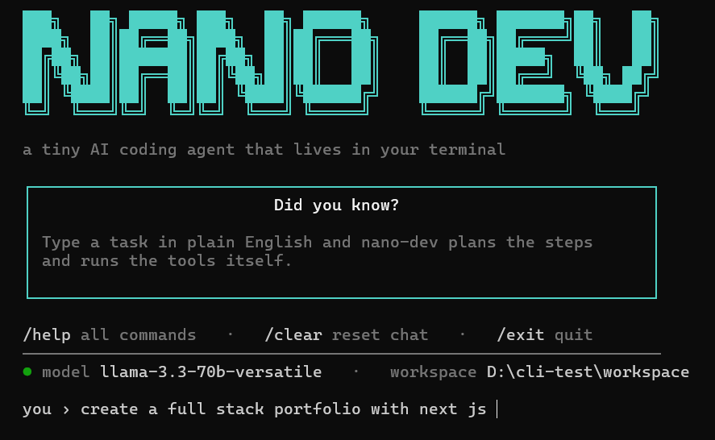

<div align="center">



### A tiny AI coding agent that lives in your terminal

Describe a task in plain English — nano-dev reads, writes, edits, and runs your code
by calling real tools in a loop, until it's done.

[](https://www.npmjs.com/package/nano-dev)
[](./LICENSE)
[](https://nodejs.org)

[Install](#install) · [Usage](#usage) · [How it works](#how-it-works) · [Commands](#commands) · [Architecture](#architecture)

</div>

---

## Install

```bash
npm install -g nano-dev
nano-dev
```

That's it. On first launch you pick a tier (see [Setup](#setup)) and you're coding.

---

## Usage

```bash
nano-dev                          # interactive session (chat with the agent)
nano-dev "create an express api"  # one-shot: run a single task and exit
nano-dev --here "fix the bug"     # work in the CURRENT folder
nano-dev --dir ./my-app "...."     # work in a chosen folder
```

```
you › build a CLI weather app
  • Writing weather.js              ✓ 1.2 kB
  • Running npm install             ✓ 4 packages added
  • Running node weather.js Tokyo   ✓ Tokyo: 18°C, clear skies

agent › Done — try: node weather.js <city>
tokens: 2,418 (in 2,090, out 328)
```

By default the agent works inside a sandboxed `workspace/` folder. Use `--here`
or `--dir` to point it at a real project.

---

## Setup

On first run, choose how to power the agent:

| Option | What you get |
| ------ | ------------ |
| **Use the default key** | Start instantly, no signup. Free, capped at 10,000 tokens. |
| **Bring your own key** | Gemini or any OpenAI-compatible endpoint. Unlimited. |

Your choice is saved to `~/.nano-dev/config.json`. Switch anytime with `/config`.

To bring your own key, grab one from
[Google AI Studio](https://aistudio.google.com/apikey) (Gemini) or any
OpenAI-compatible provider (OpenAI, Groq, etc.).

---

## Features

- **6 tools** — `read_file`, `write_file`, `edit_file` (surgical), `delete_file`, `list_files`, `run_command`
- **Self-correcting** — reads its own errors and fixes them, then re-runs
- **Safety first** — sandboxed to one folder, destructive commands blocked, risky ones need approval, hard step cap
- **Persistent memory** — sessions resume across launches; a `NANO.md` file holds project context
- **Streaming + token tracking** — watch output stream live, with a per-session token counter
- **Model-agnostic** — Gemini or any OpenAI-compatible endpoint, swappable without code changes

---

## How it works

The whole tool is one idea repeated until the task is done — the **agent loop**:

```
        You type a task in plain English
                       │
                       ▼
   ┌──────────────────────────────────────────────┐
   │                THE AGENT LOOP                  │
   │   1. Send the task + tools to the LLM          │
   │   2. The LLM replies with a tool call          │
   │   3. Run the tool                              │
   │   4. Send the result back                      │
   │   5. Repeat until done (capped by MAX_STEPS)   │
   └───────────────┬───────────────────┬────────────┘
                   ▼                   ▼
            LLM client            Tools  (read · write · edit
         (function calling)              · delete · list · run)
                                        │
                                        ▼
                                  Safety layer
                          (sandbox · confirm · step cap)
```

> The LLM is the **brain**. The tools are the **hands**. The safety layer is the **guardrails**.

---

## Commands

Type `/` and press **Tab** to autocomplete.

| Command | Description |
| ------- | ----------- |
| `/help` | Show all commands |
| `/tools` | List the agent's tools |
| `/model` | Show the active model + provider |
| `/config` | Switch default key / your own key |
| `/tokens` | Tokens used this session |
| `/remember` | Save a note to project memory (NANO.md) |
| `/clear` | Reset the conversation |
| `/exit` | Quit |

---

## Architecture

This is a monorepo with three deployable pieces:

```
.
├── server/   # the nano-dev CLI            → published to npm
├── proxy/    # serverless key proxy         → deployed to Vercel
└── client/   # the landing page (React)     → deployed to Vercel
```

| Piece | Role | Ships to |
| ----- | ---- | -------- |
| `server/` | The CLI agent: loop, tools, safety, memory | [npm](https://www.npmjs.com/package/nano-dev) |
| `proxy/` | Holds the shared API key server-side for the free tier | Vercel |
| `client/` | Marketing / landing page | Vercel |

The free-tier key never ships inside the npm package — the CLI calls the proxy,
which injects the key server-side and enforces limits. See
[`proxy/README.md`](./proxy/README.md) for deploy steps.

---

## Local development...

```bash
cd server
npm install
cp .env.example .env     # add a key for local dev
npm start                # or: node bin/index.js "your task"
npm test                 # run the test suite
```

---

## License....

[MIT](./LICENSE)

<div align="center">

Built with the agent loop · [npm](https://www.npmjs.com/package/nano-dev) · [GitHub](https://github.com/Charancherry-code/NanoDevCLI)

</div>
